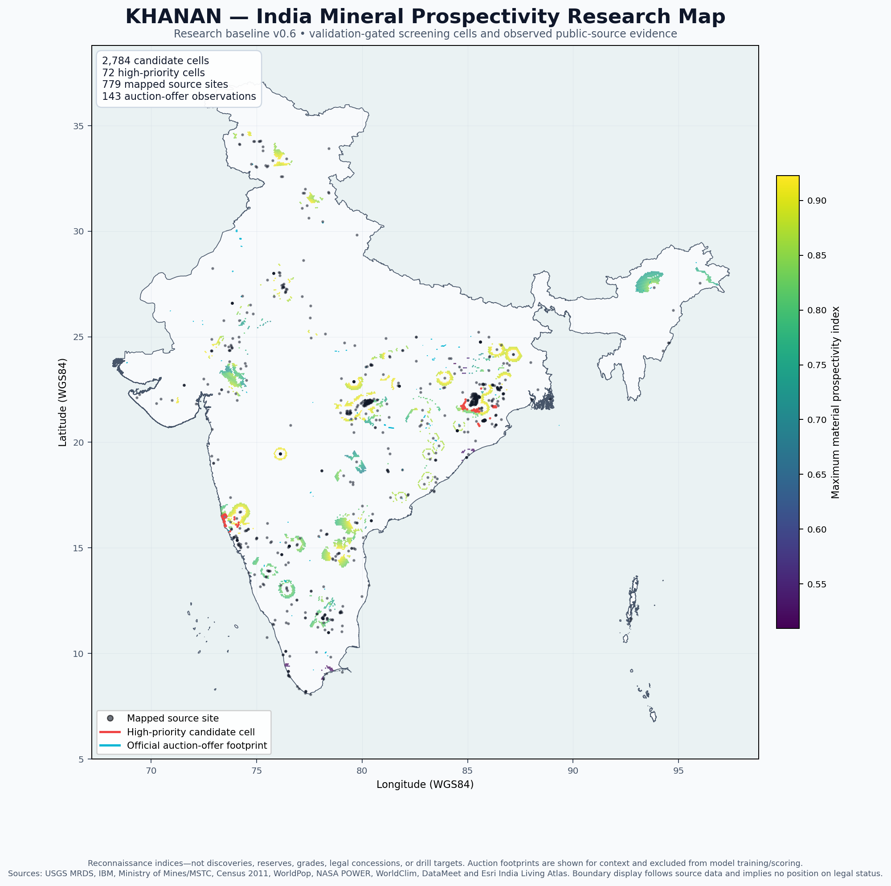

# KHANAN

**Work in progress — autonomous open-source mineral intelligence and geospatial prospectivity research for India.**

`KHANAN` means mining. The project builds an auditable, machine-readable view of India's known mining evidence, official critical-mineral auction blocks, mineral-resource context, and areas that may merit further scientific investigation.

The central idea is to divide India into consistent geospatial regions and ask, for each region:

- What mineral or metal evidence is already known nearby?
- What does its geology, terrain, climate, soil and hydrology suggest?
- What can neighbouring cells tell us without leaking known-site labels into evaluation?
- How do population, land use, vegetation and agriculture affect interpretation and responsible access?
- Which critical raw materials have enough evidence for a defensible screening model?
- How uncertain is the result, and what new evidence would most reduce that uncertainty?

KHANAN is intended to generate independent, early-stage hypotheses from lawful public information—even where a location has not yet been catalogued as a deposit. It does **not** declare a discovery or reserve, confer mining rights, authorize entry or excavation, or replace the Geological Survey of India, Indian Bureau of Mines, Ministry of Mines, State Governments, Archaeological Survey of India, environmental authorities, or affected communities.

## Current status

**Development release: v1.0-alpha.3 · Geospatial/model baseline: v0.6 · Active work in progress**

The current release covers India with 88,857 H3 resolution-6 cells, approximately 36 km² each. It includes 781 public-source site records, 1,504 IBM MCDR inspection events, 82 IBM abandoned-mine inventory records, 722 IBM NMI resource-inventory rows, 199 central critical-mineral auction events, 50 strategic modeling targets, and 2,784 validation-gated candidate cells.

The v1.0 alpha adds a source-derived material ontology with **230 unique entities**: 69 elements, 85 mineral species, and 76 ores, rocks, mineral groups, varieties, industrial materials, energy commodities, mixtures, and related material classes. It audits 450 distinct source terms: 443 are mapped and seven deliberately remain unresolved because the wording is nonspecific. Ontology coverage and prediction eligibility are separate: the validated geospatial model still scores only the 50 explicitly retained v0.6 targets.

Alpha.3 also adds a reproducible metadata audit of the National Geoscience Data Repository guest OGC services. The audit found 1,114 named WMS layers and 751 WFS feature types, then validated 11 nationally relevant mineral, geochemistry, geophysics, soil, lithology and geology layers reporting 2,459,737 features in total. These counts and schemas are catalog evidence only: no NGDR feature values are redistributed or used in the current model because dataset-specific reuse authority and essential units/method metadata remain unresolved.

Candidate scores are reconnaissance indices. They are not probabilities of discovery, resource estimates, reserves, grades, economic valuations, legal concessions, or drill targets.

## Current geospatial overview



The colour scale represents the maximum supported material-prospectivity index in each promoted cell. Black points are mapped source sites, red outlines are high-priority screening cells, and cyan outlines are official auction-offer footprints. Auction geometry is displayed for context and is excluded from model training and scoring.

The map is generated reproducibly by `scripts/plot_khanan_overview.py` from the published release tables.

## Autonomy statement

Within its digital research scope, baseline v0.6 was acquired, parsed, normalized, spatially joined, modeled, validated, visualized, documented, and packaged autonomously by AI agents under a human-defined objective. The agents preserved source wording, hashes, quality flags, and exceptions rather than silently manufacturing missing values.

The intended operating model is a continuously scheduled, 24/7 group of specialized AI agents that monitor public sources, detect changes, rebuild affected layers, test regressions, and publish versioned candidate data. That continuous scheduler is **not currently running**; it will be activated only when explicitly authorized. Field verification, legal decisions, community engagement, and permission to access land remain human responsibilities.

## How KHANAN builds the map

1. **Create a stable national grid.** The India boundary is polyfilled with H3 resolution-6 cells. Each cell retains a WGS84 centroid, polygon and area.
2. **Acquire source evidence.** Agents collect open or publicly accessible mineral occurrences, mine/prospect records, IBM inventories and inspections, official auction documents, geology, elevation, population, Census and meteorological data.
3. **Preserve provenance.** Every dataset receives source identifiers, URLs, reference dates, access notes, licensing qualifications and known limitations. Official PDFs are recorded with hashes, sizes and page counts.
4. **Normalize materials.** Source wording is crosswalked to a typed 230-entity ontology containing English names, defensible chemical names, symbols or formulae, representative ores/forms, strategic uses, authority links, and parent relationships. Vague or unmapped terms remain explicit rather than being guessed. A separate 50-material legacy set defines current model eligibility.
5. **Build cell features.** Geology, elevation, slope, relief, rolling twelve-month climate, gridded population and district demographics are spatially associated with every cell.
6. **Construct neighbourhood evidence.** The pipeline measures nearby known-site density and distance while using spatially separated folds to reduce leakage from adjacent cells.
7. **Train material-specific screens.** Models are fitted only where enough mapped evidence exists. Unsupported materials remain visibly unscored rather than receiving invented predictions.
8. **Validate spatially.** Holdout groups are separated geographically. Candidate promotion requires minimum evidence, distance, percentile, score and pseudo-absence ROC-AUC gates.
9. **Classify the national grid.** Cells are labelled `known_evidence_area`, `priority_candidate`, `high_priority_candidate`, or `regional_background` with model support and quality flags.
10. **Cross-check official geometries.** Auction footprints are validated for polygon integrity, published-area agreement and stated-state consistency. Source conflicts are retained and flagged.
11. **Package for data science.** The release emits canonical CSVs, validation JSON, a source registry, a data dictionary, checksums, a review workbook and a compressed portable bundle.
12. **Iterate without rewriting history.** Each material change produces a versioned release; validation failures block publication rather than being hidden.

## Feature readiness

| Signal family | Current state | Intended use and safeguards |
|---|---|---|
| Known mines, prospects and occurrences | Implemented | Positive evidence with source-specific quality controls. |
| IBM abandoned-mine inventory | Implemented as context | Named historical-status records; excluded from scoring because the source publishes no coordinates or controlling current status. |
| Official auction footprints and results | Implemented | Inventory/overlay context only; excluded from model evidence. |
| Geological map units | Implemented | Regional age, group, supergroup and stratigraphic context. |
| Terrain | Implemented | Elevation, approximate slope, relief and terrain class. |
| Weather and climate | Implemented | Daily-derived twelve-month temperature, precipitation, humidity and wind summaries. |
| Population and demographics | Implemented | Responsible-planning context; not a geological cause of mineralization. |
| Soil texture, chemistry and regolith | Service catalog audited; not model-integrated | NGDR soil and geochemical schemas/counts are recorded. Raw values remain excluded pending dataset-specific reuse authority, units, methods, detection limits and missingness metadata. |
| Satellite mineral and alteration signatures | Planned | Multispectral/hyperspectral indices with cloud, season and sensor uncertainty. |
| Vegetation, crop ecology and phenology | Planned | Possible indirect soil, moisture or geochemical stress signals; must survive independent validation. |
| Agriculture and aggregate dietary patterns | Research-only/planned | Area-level context only. Never individual-level data and never treated as causal mineral evidence without a defensible scientific mechanism. |
| Hydrology and groundwater chemistry | Planned | Catchment-aware transport and geochemical anomaly context. |
| Geophysics, geochemistry and drilling | NGDR catalog audited; values not integrated | Eleven authoritative layers are machine-readably inventoried. Production use remains gated by access, redistribution, units, methods, scale, processing, leakage and spatial-validation checks. |
| Infrastructure and environmental constraints | Planned | Roads, rail, power, water, forests, protected areas, archaeology, tenure and social safeguards. |

## Release files

The current portable development release is [`outputs/india_mining_dataset_csv_bundle_v1.0-alpha.3.zip`](outputs/india_mining_dataset_csv_bundle_v1.0-alpha.3.zip). An earlier v0.6 copy is also stored on [Google Drive](https://drive.google.com/file/d/1IpbPo6m7BDNr1rZcyEMelUfCNJneQBIf/view?usp=drivesdk) in the [KHANAN Drive folder](https://drive.google.com/drive/folders/1K3o1FL2Wxoe-Cz8GiohFSYiV2XZ2FsIL); its availability follows the owner's Drive sharing settings, and it is not the current alpha artifact. The uncompressed nationwide grid is excluded from the Git checkout because it exceeds GitHub's ordinary file-size limit, but it is included in the portable bundle.

| File | Rows | Role |
|---|---:|---|
| `outputs/india_mining_prospectivity_grid_h3_r6.csv` | 88,857 | Complete national H3 grid with geology, terrain, climate, population, demographics, material scores, validation and quality flags. Included inside the current portable bundle. |
| `outputs/india_mining_candidate_areas_validation_gated.csv` | 2,784 | Validation-gated priority and high-priority cells, ranked nationally. |
| `outputs/india_known_mining_sites.csv` | 781 | Georeferenced mines, past producers, prospects, occurrences, plants and unknown-status MRDS records. |
| `outputs/india_ibm_mcdr_inspection_events_2023_2026.csv` | 1,504 | IBM regional MCDR inspection-table events; not proof of production or compliance. |
| `outputs/india_ibm_mcdr_latest_inspected_mines.csv` | 1,353 | Practical latest-event view of MCDR records. |
| `outputs/india_ibm_abandoned_mine_sites.csv` | 82 | IBM's named abandoned/orphaned-mine inventory for reclamation context; no coordinates or current-status inference. |
| `outputs/india_ibm_nmi_2025_resource_inventory.csv` | 722 | IBM NMI national, grade/measure and state/UT reserves/resources as at 1 April 2025. |
| `outputs/india_official_critical_mineral_blocks.csv` | 199 | 143 auction offers across tranches I–VIII plus 56 successful results through tranche VII. |
| `outputs/india_official_critical_mineral_mbs_manifest.csv` | 143 | MBS/NIT provenance, document hashes, extraction methods and geometry checks. |
| `outputs/india_strategic_materials_top50.csv` | 50 | Legacy v0.6 modeling-target set, chemical names, formulae, ores/forms, uses and source linkage. |
| `outputs/india_material_ontology_v1.csv` | 230 | Typed material identities, authority metadata, source evidence, formulas/names, relationships and model-eligibility fields. |
| `outputs/material_source_term_crosswalk_v1.csv` | 450 | Auditable mapping of raw terms from MRDS, IBM NMI, IBM MCDR, IBM abandoned mines, auctions and USGS MCS to ontology entities. |
| `outputs/material_ontology_validation_v1.json` | 1 | Ontology uniqueness, type counts, parser coverage, source hashes, mapping rate and unresolved-term report. |
| `outputs/material_model_support.csv` | 50 | Evidence counts and support tier by material. |
| `outputs/material_model_validation.csv` | 50 | Spatial holdout results and reasons a material could not be validated. |
| `outputs/ngdr_service_inventory.csv` | 11 | Metadata-only inventory of selected NGDR mineral, geochemistry, geophysics, soil, lithology and geology services; no feature values. |
| `outputs/source_registry.csv` | 28 | Provenance, access/licensing notes, uses and limitations. |
| `outputs/data_dictionary.csv` | 539 | Field definitions, units and missing-value policies. |
| `outputs/validation_report.json` | 1 | Cross-dataset counts, join coverage, coordinate checks and guardrails. |
| `outputs/official_critical_blocks_validation.json` | 1 | Auction count, lineage, provenance and geometry validation. |
| `outputs/ibm_nmi_2025_extraction_validation.json` | 1 | NMI PDF extraction and UNFC subtotal validation. |
| `outputs/ibm_mcdr_inspection_validation.json` | 1 | IBM page, fiscal-year, date and document-link validation. |
| `outputs/ibm_abandoned_mines_validation.json` | 1 | IBM source-page hash, narrative funnel, row counts, material mappings and mandatory model exclusions. |
| `outputs/ngdr_service_validation.json` | 1 | Live OGC capability hashes, selected-layer counts, bounded-probe checks and redistribution/model exclusions. |
| `outputs/nasa_power_rolling_12m_validation.json` | 1 | Weather-source checksums, completeness and range checks. |
| `outputs/india_mining_dataset_companion.xlsx` | — | Legacy v0.6 thirteen-sheet review workbook. It does not yet include the v1 ontology; the CSVs remain authoritative. |
| `outputs/india_mining_dataset_csv_bundle_v1.0-alpha.3.zip` | — | Portable 39-member development bundle, including the full grid, v1 ontology, IBM abandoned-mine layer, NGDR service audit, validations, project map and reproducibility scripts. |
| `outputs/SHA256SUMS.txt` | — | Integrity hashes for published artifacts. |

## Repository structure

```text
KHANAN/
├── assets/
│   ├── README.md
│   └── maps/                         # README and release figures
├── config/                           # material, weather and curated event configuration
├── data/
│   └── README.md                     # data-layout and distribution policy
├── docs/
│   ├── methodology.md                # scientific method, validation and limitations
│   └── ngdr_access_and_integration.md # GSI service audit, policy decision and admission gates
├── outputs/                          # versioned derived data and release artifacts
├── scripts/                          # acquisition, extraction, modeling, validation and plotting
├── sources/
│   └── raw/                          # reproducible local source cache; not committed to Git
├── .gitignore
├── requirements-geospatial.txt
└── README.md
```

## Detailed roadmap

### Phase 0 — Auditable baseline (completed in v0.6)

- Establish the national H3 grid and record schema.
- Integrate MRDS, IBM NMI, MCDR, Ministry of Mines/MSTC, Census, WorldPop, NASA POWER, WorldClim and regional geology.
- Build the 50-material modeling-target set and spatial validation gates.
- Publish source manifests, dictionaries, checksums and interpretation guardrails.
- Recover and validate all 143 central critical-mineral auction-offer footprints for tranches I–VIII.

### Phase 1 — Repository and release discipline (current)

- Maintain KHANAN as a structured, versioned repository.
- Publish reproducible overview maps and machine-readable release bundles.
- Publish the 230-entity, source-derived ontology and raw-term mapping audit without expanding model eligibility by fiat.
- Audit the public NGDR/GSI OGC catalog and publish a metadata-only readiness inventory without republishing feature values.
- Add automated schema, provenance, checksum and regression tests.
- Introduce changelogs and source freshness reports.
- Define source-specific redistribution and citation policy before any public release.

### Phase 2 — Authoritative mine, lease and grant layer

- Add current IBM and State Directorate of Mines and Geology registers where lawfully accessible.
- Preserve IBM's 82-site abandoned-mine inventory as non-georeferenced, historical-status context until controlling current records can be joined.
- Resolve mine/block identity across spelling, mine codes, lease numbers and changing district boundaries.
- Track tender, preferred-bidder, grant, clearance, operation, suspension and closure as separate dated events.
- Add lease and legal-boundary polygons without inferring unpublished coordinates.

**Exit gate:** every claimed operating/legal status must have a dated controlling source and confidence level.

### Phase 3 — Soil, surface and ecological intelligence

- Integrate harmonized soil texture, pH, organic carbon, clay/mineral fractions and regolith data.
- Add land cover, vegetation indices, crop calendars, phenology, moisture stress and thermal anomalies.
- Add drainage, watersheds, erosion, groundwater and surface-water context.
- Test whether vegetation or crop signals add out-of-region predictive value after geology and climate are controlled.

**Exit gate:** indirect ecological signals are admitted only if they improve spatial holdout performance and have a plausible mechanism.

### Phase 4 — Geochemistry, geophysics and remote sensing

- **Completed in alpha.3:** audit the NGDR guest OGC catalog, selected layer schemas, reported feature counts, coordinate metadata and GSI dissemination policy.
- Acquire lawful NGDR/GSI/state geochemical, magnetic, gravity, radiometric and structural datasets.
- Add multispectral and hyperspectral mineral/alteration indices with sensor provenance.
- Normalize samples by analytical method, detection limit, medium, depth and survey scale.
- Construct deposit-type features for battery, fertilizer, alloy, electronics and energy raw materials.

**Exit gate:** no dataset enters production scoring without coordinate, method, scale, missingness and leakage audits.

### Phase 5 — 24/7 autonomous agent system

- **Source Scout:** monitor official portals, publications and open-data catalogues.
- **Acquisition Agent:** download versioned source snapshots and compute hashes.
- **Document Agent:** extract tables, coordinates and provenance from PDFs and web pages.
- **Geo Agent:** harmonize CRS, administrative boundaries, geometry and neighbourhood features.
- **Ontology Agent:** map minerals, elements, compounds, ores and industrial uses.
- **Model Agent:** retrain only affected material models and preserve prior artifacts.
- **Critic Agent:** challenge leakage, source conflicts, implausible values and unsupported claims.
- **Release Agent:** publish only when tests pass; otherwise quarantine the proposed update.

**Exit gate:** deterministic rebuilds, idempotent source handling, rollback, audit logs, cost controls and human approval for external publication.

### Phase 6 — Stronger prospectivity science

- Replace generic material screens with deposit-type and geological-process models.
- Add spatially independent positive test deposits and time-split validation.
- Quantify epistemic, source and spatial uncertainty.
- Calibrate rankings and compare against transparent geological heuristics.
- Add feature ablation, bias/fairness checks and adversarial leakage tests.

**Exit gate:** candidates must outperform simple baselines outside the regions used for training.

### Phase 7 — Responsible opportunity assessment

- Add protected areas, forests, water stress, cultural/archaeological sites, tenure and community context.
- Add roads, rail, ports, power and processing infrastructure without turning proximity into permission.
- Build exclusion and caution layers before any field-prioritization product.
- Establish an expert-review and community-engagement protocol.

**Exit gate:** no operational recommendation without legal, environmental, archaeological, social and field review.

### Phase 8 — Data-science and decision interfaces

- Publish GeoParquet/PostGIS-ready releases and STAC-compatible raster metadata.
- Add APIs, reproducible notebooks, benchmark tasks and model cards.
- Provide uncertainty-aware map exploration and region/material comparison.
- Support user-supplied data without contaminating the public evidence layer.

## Reproduce the current baseline

From the repository root:

```bash
python3 -m venv .venv
.venv/bin/pip install -r requirements-geospatial.txt
.venv/bin/python scripts/download_sources.py
.venv/bin/python scripts/build_dataset.py
.venv/bin/python scripts/build_official_mbs_inventory.py
.venv/bin/python scripts/build_official_blocks.py
.venv/bin/python scripts/build_ibm_nmi2025.py
.venv/bin/python scripts/build_ibm_mcdr_inspections.py --refresh
.venv/bin/python scripts/build_ibm_abandoned_mines.py --refresh
.venv/bin/python scripts/build_material_ontology.py
.venv/bin/python scripts/audit_ngdr_services.py
.venv/bin/python scripts/plot_khanan_overview.py
.venv/bin/python scripts/build_release.py
```

The XLSX companion is generated by `scripts/build_workbook.mjs` using the Codex desktop bundled spreadsheet runtime. See `docs/methodology.md` for model construction, validation thresholds and detailed limitations.

## Scientific, legal and ethical guardrails

- A predicted cell is a hypothesis for regional investigation, not evidence of a mineable deposit.
- Resources and reserves require qualified exploration, sampling, estimation and legally recognized reporting.
- Absence of a candidate label does not mean barren ground.
- Population, demographic, dietary, agricultural and ecological data must not become proxies for targeting communities or bypassing consent.
- Do not trespass, sample, drill, excavate, acquire rights, or approach protected/archaeological land based on this dataset.
- Government, environmental, forest, land, heritage and community processes remain mandatory.
- Boundary displays follow their cited source and imply no position on legal or territorial status.
- Third-party source terms vary. KHANAN does not assert a blanket license over source material; consult `outputs/source_registry.csv` before redistribution or commercial use.

## Important current limitations

The release is not an exhaustive current mine/lease register. It still lacks deposit-level NMI coordinates, comprehensive state mine registers, controlling grant status, model-admitted high-resolution soil/geochemistry/geophysics, drill logs, site-level grade/tonnage/depth, alteration mapping, protected-area and forest-clearance layers, water stress, infrastructure, land tenure and social-license constraints. NGDR service metadata is now audited, but its raw values remain outside the release and scoring pipeline for the reasons documented in [`docs/ngdr_access_and_integration.md`](docs/ngdr_access_and_integration.md).

One official Biarpalli source table places an Odisha block near 89°E; KHANAN retains and flags the published coordinates. The 143 auction-offer observations reconstruct to 100 distinct published footprints, while the tranche-VIII government release reports 88 cumulative offered blocks. That discrepancy remains explicitly unreconciled.

For the complete provenance and interpretation contract, read [`docs/methodology.md`](docs/methodology.md), [`outputs/source_registry.csv`](outputs/source_registry.csv), and [`outputs/data_dictionary.csv`](outputs/data_dictionary.csv).
