# KHANAN

**Work in progress — autonomous open-source mineral intelligence and geospatial prospectivity research for India.**

`KHANAN` means mining. The project builds an auditable, machine-readable view of India's known mining evidence, official critical-mineral auction blocks, mineral-resource context, and areas that may merit further scientific investigation.

The central idea is to divide India into consistent geospatial regions and ask, for each region:

- What mineral or metal evidence is already known nearby?
- What does its geology, terrain, climate, soil and hydrology suggest?
- What can neighbouring cells tell us without leaking known-site labels into evaluation?
- How do population, land use, vegetation and agriculture affect interpretation and responsible access?
- Which critical raw materials have enough evidence for a defensible screening model?
- How uncertain is the result, and what new evidence would most reduce that uncertainty?

KHANAN is intended to generate independent, early-stage hypotheses from lawful public information—even where a location has not yet been catalogued as a deposit. It does **not** declare a discovery or reserve, confer mining rights, authorize entry or excavation, or replace the Geological Survey of India, Indian Bureau of Mines, Ministry of Mines, State Governments, Archaeological Survey of India, environmental authorities, or affected communities.

## Current status

**Alpha 3.0 completion release: v1.0-alpha.30 · Geospatial feature baseline: v0.12 · Prospectivity model baseline: v0.6 · Declared project scope complete**

The current release covers India with 88,857 H3 resolution-6 cells, approximately 36 km² each. It includes 781 public-source site records, 1,504 IBM MCDR inspection events, 82 IBM abandoned-mine inventory records, 722 IBM NMI resource-inventory rows, 123 IBM 2024 lease-distribution rows, 97 IBM auction-granted concession records, five dated Andhra auction-status evidence rows, 586 IBM State Review occurrence-geography rows expanded into 1,742 district-crosswalk records and 59,872 H3 context rows, 199 central critical-mineral auction events, 78 public-preview rows from eight historical GSI/OGD deposit catalogues, 13 independently published EarthChem geochemical samples represented by 1,323 long-form measurements, 950 selected Sentinel-2 scenes summarized over 8,707,986 requested seasonal sample points, 50 strategic modeling targets, and 2,784 validation-gated candidate cells.

The v1.0 alpha includes a source-derived material ontology with **254 unique entities**: 69 elements, 89 mineral species, and 96 ores, rocks, mineral groups, varieties, industrial materials, energy commodities, mixtures, and related material classes. It audits 611 distinct source/table/field terms: 602 are mapped and nine deliberately remain unresolved because the wording is nonspecific. Ontology coverage and prediction eligibility are separate: the validated geospatial model still scores only the 50 explicitly retained v0.6 targets.

Alpha.3 also adds a reproducible metadata audit of the National Geoscience Data Repository guest OGC services. The audit found 1,114 named WMS layers and 751 WFS feature types, then validated 11 nationally relevant mineral, geochemistry, geophysics, soil, lithology and geology layers reporting 2,459,737 features in total. These counts and schemas are catalog evidence only: no NGDR feature values are redistributed or used in the current model because dataset-specific reuse authority and essential units/method metadata remain unresolved.

Alpha.4 adds an independently redistributable magnetic-context layer from NOAA/NCEI EMAG2v3. It samples the two-arc-minute, 4 km upward-continued anomaly, published error estimate and source-grid code for all 88,857 H3 cells, with local 3×3-pixel summaries and explicit source gaps. Valid anomaly coverage is 95.31%; valid error coverage is 92.78%. The 6,418 ambiguous/no-data source-code cells are retained and flagged. These features are present in the national and candidate tables but deliberately do **not** alter v0.6 rankings until spatial ablation and leakage tests demonstrate out-of-region value.

Alpha.5 completes that first spatial ablation. It compares paired baseline and baseline-plus-EMAG models under H3 resolution-3 group holdout, a 50 km training purge around held-out positives, fold-only preprocessing, unique-cell positive labels and 500-replicate spatial-group bootstrap intervals. Fourteen materials have enough unique-cell support for evaluation, producing 70 completed folds. None passes the predefined admission gate: nine point estimates improve, five decline, and no positive AUC change has a strictly positive uncertainty interval. Candidate scores, classes and ranks therefore remain byte-for-byte unchanged.

Alpha.6 adds a CC BY 4.0 national soil-context layer from ISRIC SoilGrids 2.0. It samples nine properties at 0–5 cm and 30–60 cm for all 88,857 cells, retaining mean, p05 and p95 predictions from 54 hashed WCS rasters. Minimum national coverage is 99.28%; all prediction intervals are ordered and the maximum centroid-to-source-pixel distance is 1.938 km. Soil values and derived USDA texture classes are present in the national and candidate tables but remain context only. Protected production-ranking columns are unchanged.

Alpha.7 completes the paired spatial ablation of SoilGrids. It reuses the exact deterministic samples, purged H3 resolution-3 folds and baseline predictions from the EMAG2 experiment, then adds 18 property means and 18 p05–p95 uncertainty widths. Fourteen materials produce 70 completed folds. Four point estimates improve and ten decline, but no positive AUC change has a strictly positive uncertainty interval. No material passes the fixed admission gate, so candidate scores, classes and ranks remain unchanged.

Alpha.8 adds the authoritative IBM 2024 mineral-concession context. It transcribes 123 state/year, mineral, sector and area-band lease aggregates plus all 97 named mining leases or composite licences that IBM describes as granted through auction during 2023–24. The 2024 national total is 2,995 leases over 293,811.5373 hectares within the source's stated exclusions. The block table has no coordinates, geometries or controlling current-status records, so all rows remain context only and candidate rankings are unchanged. See [`docs/ibm_mineral_concessions_2024.md`](docs/ibm_mineral_concessions_2024.md).

Alpha.9 begins authoritative spatial reconciliation for those 97 IBM auction rows. It inventories 1,124 Mine Block Summary links across the ten relevant State sections of the MSTC portal, reviews eleven exact block-name matches, and admits eight source-published footprints after polygon validity, source-state centroid and 5% area checks. Three reviewed footprints are withheld: Saloni has a 600 ha versus 670 ha IBM/MBS source conflict, Kareli-Chandi prints malformed seconds for two vertices, and Goa Block VI computes 25.31% below its published area. The eight admitted rows include source coordinates, document hashes, exploration level, drilling, geological resource, grade, climate, topography, hydrography and accessibility context. They remain excluded from model labels and scoring because neither the MBS nor the IBM compilation independently proves current operation or present legal status. See [`docs/ibm_auction_mbs_geometry_2023_24.md`](docs/ibm_auction_mbs_geometry_2023_24.md).

Alpha.10 extends that reviewed set to seventeen exact State MBS matches and adds source profiles to the full 97-row audit. It reviews all three IBM rows for Jharkhand and all three for Uttar Pradesh, admitting the Bharhari iron-ore and Sona Pahari gold footprints. Chiropat is withheld because two latitude cells print an `E` hemisphere, Baraiburu-Tatiba and Meralgara-Barabaljori publish only bounding extents, and Girar fails both source-area and coordinate-derived area reconciliation. The geometry layer now contains ten admitted footprints, while seven reviewed records are explicitly withheld and 80 remain unreviewed. Candidate scores remain unchanged.

Alpha.11 reviews all six Karnataka rows in the IBM 2023-24 table and deliberately chooses the highest-numbered official document when the portal contains several attempts. Four footprints pass: Block No. 04 HRG and Jaisinghpura North iron-ore blocks, Basavangudda gold block, and Niddodi bauxite block. Timmanahalli is withheld because one latitude prints `60.00` seconds, and Kudarka is withheld because its coordinate table omits hemisphere markers. Niddodi's valid boundary is admitted, but its source conflict—bauxite title and Al2O3 grade text versus an `Iron ore` quantity-row label—is preserved. The State MBS review now covers 23 PDFs, with 14 admitted footprints, nine reviewed-withheld records and 74 unreviewed IBM rows. Candidate scores remain unchanged.

Alpha.12 reviews all six Gujarat rows using exact normalized Phase IX titles so that later similarly named portal blocks cannot be selected accidentally. Mevasa Block-1, Mevasa Block and Kukaras pass the full polygon, State-containment and area-reconciliation gates. Nandana is withheld because BP-5 contains a longitude outlier and its IBM/MBS areas conflict; Kodidra and Virpur-Lusari are withheld because IBM and the exact-title MBS documents publish materially different areas. The State MBS review now covers 29 PDFs, with 17 admitted footprints, twelve reviewed-withheld records and 68 unreviewed IBM rows. Candidate scores remain unchanged.

Alpha.13 reviews all five Andhra Pradesh IBM rows. The current public State MBS index contains no exact-name boundary document for Adakula, Addankivaripalem, Lakshmakapalle North, Lakshmakapalle South or Mincheri RF, so KHANAN publishes no new polygon. Instead, a separate status-evidence table links all five records to two dated government sources. The Prakasam District Administration page reports areas, licence milestones, Form-C dates and drilling progress for the three JSW iron-ore blocks. A Ministry of Mines January 2025 presentation records Adakula and Mincheri as LoI-pending at that historical snapshot, with bidder and bid details. The Ministry's Mincheri auction date conflicts with IBM and both are preserved. The State MBS audit now has 34 reviewed rows: 29 selected PDFs, five reviewed-without-public-boundary matches, 17 admitted footprints, twelve MBS-withheld records and 63 unreviewed IBM rows. Candidate scores remain unchanged. See [`docs/ibm_auction_status_evidence_2023_24.md`](docs/ibm_auction_status_evidence_2023_24.md).

Alpha.14 reviews all ten Maharashtra IBM rows using the live MSTC State index and tranche-aware exact-title matching: Phase X for the May 2023 records and Phase XI for the November records. Five Surjagad iron-ore footprints, Minzhari copper and Savali manganese pass source-order polygon, State-containment and 5% area reconciliation gates. Devalmari-Katepalli and South Padve are withheld because their selected PDFs publish bounding extents rather than ordered vertices; Kondhala is withheld because its coordinates compute to about 162.74 ha versus the MBS-published 105 ha. Printed seasonal-temperature and rainfall-unit anomalies remain visible in the audit. The State MBS audit now has 44 reviewed rows: 39 selected PDFs, five reviewed-without-public-boundary matches, 24 admitted footprints, fifteen MBS-withheld records and 53 unreviewed IBM rows. Candidate scores remain unchanged.

Alpha.15 reviews all 22 Madhya Pradesh IBM rows against the browser-verified Phase XI block of the live State portal. Exact MSTC file identifiers are pinned so later same-name phases cannot overwrite the historical IBM tranche. Fifteen footprints pass polygon validity, State-centroid and 5% area-reconciliation gates; seven are reviewed but withheld because of invalid source-order polygons or published-area conflicts. The audit now covers 66 of 97 IBM rows: 61 selected PDFs, five Andhra reviewed-without-current-public-boundary matches, 39 admitted footprints, 22 selected-MBS withholds and 31 unreviewed Rajasthan rows. Resource, grade, drilling, climate and source anomalies are retained, while candidate scores remain unchanged.

Alpha.16 completes review of all 97 IBM rows by adding the 31 Rajasthan records from browser-verified historical portal tranches. Twenty-eight Rajasthan footprints pass the unchanged polygon, State-centroid and 5% area gates. Khakhliya Khera is withheld because its two existing-lease exclusion rings conflict with the outer boundary and stated free area; Pipaliya and Manpura are withheld because their IBM areas are mutually swapped relative to the named MBS documents and coordinate-derived areas. The complete audit now contains 92 selected PDFs, five Andhra reviewed-without-current-public-boundary matches, 67 admitted footprints and 25 selected-MBS withholds. All source documents remain context only and the v0.6 candidate scores are unchanged.

Alpha.17 adds the first redistributable, coordinate-bearing analytical geochemistry layer. EarthChem ECL 4498 contributes 13 published samples at two western-Assam coordinate sites: 663 whole-rock observations across 51 major-oxide, trace-element and Sr–Nd parameters, plus 660 electron-microprobe mineral-spot observations across 12 parameters. The source archive and both workbooks match publisher SHA-1 checksums and carry CC-BY-4.0 attribution. Source blanks, `b.d.l.`, unresolved `NA` tokens and dashes remain distinct; method-code and beam-diameter anomalies are retained and flagged. These targeted petrological samples are independent context, not a regional survey, mine, reserve or discovery, and remain excluded from v0.6 training and validation. See [`docs/earthchem_lithium_geochemistry.md`](docs/earthchem_lithium_geochemistry.md).

Alpha.18 adds nationwide, two-season Copernicus Sentinel-2 Level-2A surface context. The pipeline selects 475 India-relevant MGRS scenes in each fixed 2025 window, samples every one of the 49 H3 resolution-8 child centroids in all 88,857 parent cells, applies product-specific bottom-of-atmosphere radiometry and native 20 m scene classification, and publishes six-band reflectance, five broad indices, two exploratory ratios, coverage and support flags. Complete 49-of-49 coverage is 97.16% in each season, 98.96% of cells have at least one clear-land observation and 84.25% have bare-surface support in both windows. These are non-specific surface and confounder-control features—not mineral detections—and remain excluded from v0.6 scoring. See [`docs/sentinel2_surface_context.md`](docs/sentinel2_surface_context.md).

Alpha.19 completes the first paired spatial ablation of that surface family. A compact 18-feature Sentinel extension is compared with the exact published baseline across 70 purged H3 resolution-3 folds for fourteen supported materials. Four point estimates improve and ten decline. Vanadium's large improvement has only ten positive cells; Silver's supported and uncertainty-positive improvement reduces high-score recall; Lead's interval crosses zero. Titanium, manganese and phosphorus have wholly negative intervals. A separate hard guardrail records that 2025 imagery at known mines can encode post-discovery surface disturbance. No material passes every fixed support, coverage, AUC, uncertainty, recall and leakage gate, so candidate scores and ranks remain unchanged. See [`docs/sentinel2_spatial_ablation.md`](docs/sentinel2_spatial_ablation.md).

Alpha.20 tests v0.6 against official source footprints that never entered training or scoring. It deduplicates central auction reoffers to 99 accepted block lineages, combines them with 67 admitted State auction MBS footprints, and evaluates 221 normalized block-material observations. All 444,285 published top-five score, percentile and distance values are independently reproduced exactly before testing. Twelve materials have at least five block centroids beyond 25 km from same-material MRDS evidence. Manganese separates strongly from background (`0.9517` AUC, interval `0.8663–0.9890`) but has only seven blocks in three broad spatial groups. Iron and Phosphorus have positive point estimates with intervals crossing chance; Graphite is below the AUC gate; Vanadium, Titanium and Molybdenum transfer poorly. No material passes every predeclared statistical gate. Official targeting is also not proven independent of all historical geological knowledge, so no score, class or rank changes. See [`docs/official_block_transfer_validation.md`](docs/official_block_transfer_validation.md).

Alpha.21 adds a reproducible historical GSI Open Government Data deposit-catalog preview layer for bauxite, baryte, copper, diamond, gold, iron, lead-zinc and manganese. The eight catalogue pages report 381 records, while the public preview endpoint exposes 78 (20.47%); the other 303 cannot be represented without completing the portal's interactive download process. KHANAN preserves raw coordinate text, distinguishes 60 point records from 18 coordinate ranges, maps ranges by an explicitly labeled midpoint, checks representative points against 2011 State boundaries, and records cross-source proximity without treating agreement as independence. The layer is non-random, incomplete, has no stated coordinate datum, and remains excluded from training, validation, candidate promotion and discovery claims. See [`docs/gsi_ogd_mineral_deposit_preview.md`](docs/gsi_ogd_mineral_deposit_preview.md).

Alpha.22 adds the latest IBM State Review mineral-occurrence geography as a separate non-scoring layer. The page-referenced extraction contains 586 rows across 31 source regions and 101 source material terms, linked to 91 existing ontology entities with six English-name fallbacks. It expands to 1,742 district-crosswalk rows: 1,734 unambiguous one-to-one matches enter a sparse 59,872-cell H3 context table, while eight candidates from the historical parent names `24-Parganas` and `Midnapur` are retained but withheld from cell propagation. All configured material and place terms pass source-page text checks. District coordinates are representative indexing points, not mineral locations, and the layer does not alter any v0.6 score or rank. The release packager now normalizes ZIP timestamps and permissions; two complete rebuilds produced identical artifact and bundle hashes. See [`docs/ibm_imyb_state_review_occurrences_2024.md`](docs/ibm_imyb_state_review_occurrences_2024.md).

Alpha.23 reconciles those 101 IBM State Review terms with the central ontology. It adds 21 source-observed entities—including diaspore as an exact IMA-listed species and separately typed clay commodities, rocks, ore classes and mineral mixtures—bringing the catalogue to 254 entities. All 101 IBM terms now map to 109 relevant ontology IDs, and mixed-material rows retain a chemical name where one exists plus an English fallback for every entity without one. The ontology validator confirms all additions carry IBM source attribution and that the national grid and candidate-table hashes remain unchanged. Model eligibility stays at 50 targets. See [`docs/material_ontology_v1.md`](docs/material_ontology_v1.md).

Alpha.24 freezes the current release schemas and consolidates coverage limitations. A 44-row artifact manifest registers all 43 public CSVs plus the auction-footprint GeoJSON with primary keys, schema and content hashes, source lineage, geographic and temporal scope, evidence roles, model-use restrictions, uncertainty fields and exclusion controls. The rebuilt data dictionary has one definition for each of the 1,928 published CSV columns. A separate 58-row coverage register preserves all 38 source-specific limitations and 20 project-wide geographic, temporal, licensing, access, method, validation and operational gaps. All keys and schemas pass, while the national-grid and candidate hashes remain unchanged. See [`docs/release_governance_alpha24.md`](docs/release_governance_alpha24.md).

Alpha.25 independently verifies the portable release without importing any KHANAN builder or packager. It closes a reproducibility gap by adding every manifest-referenced builder, the source downloader, workbook builder, release packager, PDF helper and geospatial requirements file to the ZIP. The verifier recomputes schemas, keys, hashes, dictionary coverage, source-to-gap lineage, validation gates, status guardrails and exact candidate-to-grid parity. No evidence, model score, class or rank changes. See [`docs/independent_release_verification_alpha25.md`](docs/independent_release_verification_alpha25.md).

Alpha 3.0 (`v1.0-alpha.30`) closes the user-defined project scope. It adds an exact typed Polygon GeoJSON counterpart for all 2,784 ranked candidate cells and a machine-readable completion audit. All 12 consolidated completion requirements pass, including reliable 254-entity material coverage, source-term normalization, evidence-family integration, role separation, spatial validation, uncertainty and exclusions, gap disclosure, schema governance and unsupported-claim guardrails. The independent release verifier checks the final ZIP, candidate CSV/GeoJSON parity and frozen model hashes. No evidence, score, class or rank changes. See [`docs/alpha3_final_release_audit.md`](docs/alpha3_final_release_audit.md).

Candidate scores are reconnaissance indices. They are not probabilities of discovery, resource estimates, reserves, grades, economic valuations, legal concessions, or drill targets.

## Current geospatial overview


The colour scale represents the maximum supported material-prospectivity index in each promoted cell. Black points are mapped source sites, red outlines are high-priority screening cells, and cyan outlines are official auction-offer footprints. Auction geometry is displayed for context and is excluded from model training and scoring.

The map is generated reproducibly by `scripts/plot_khanan_overview.py` from the published release tables.

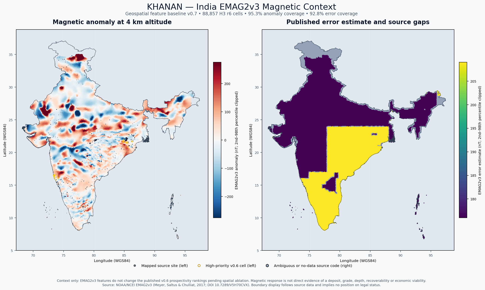

The second figure separates the signed magnetic anomaly from its published error estimate and source gaps. It is a geophysical context map, not a mineral-deposit map. Yellow rings show the existing high-priority v0.6 cells only as a comparison overlay; EMAG2v3 has not been used to create or rerank them. It is generated by `scripts/plot_emag2_context.py`.

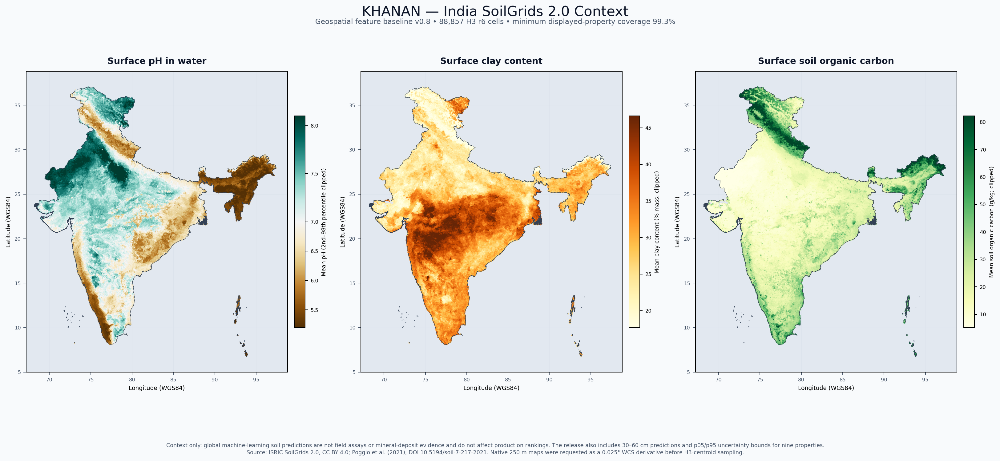

The third figure maps surface pH, clay and soil organic carbon. The release also contains the same properties at 30–60 cm, six additional soil properties, and p05/p95 prediction bounds. These are modeled pedological context—not geochemical assays or evidence of a deposit—and do not affect candidate rankings. The map is generated by `scripts/plot_soilgrids_context.py`.

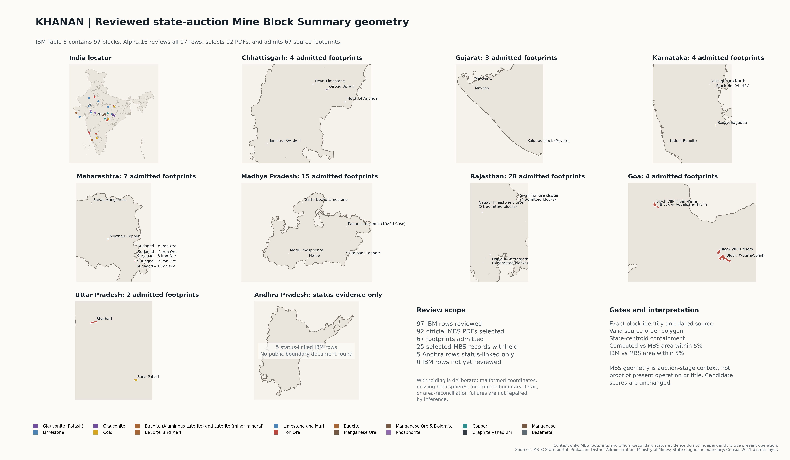

The fourth figure locates all 67 IBM Table 5 blocks whose matched State Mine Block Summaries passed the geometry gates. Rajasthan adds 28 admitted historical footprints spanning iron ore, limestone and base-metal/copper context; three Rajasthan records remain visible in the audit as reviewed source conflicts. The Andhra Pradesh panel remains status evidence only. The map is generated by `scripts/plot_ibm_auction_mbs_geometries.py`.

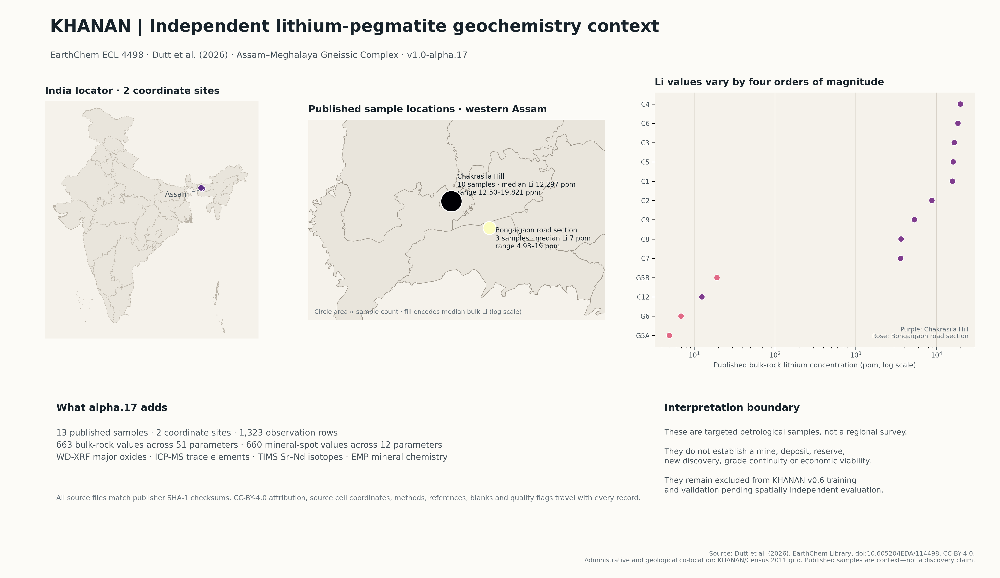

The fifth figure locates the two coordinate sites, summarizes the published bulk-rock lithium range across all 13 samples, and states the analytical scope and interpretation boundary. The values are real source measurements, but the targeted sampling design cannot support a regional discovery claim. It is generated by `scripts/plot_earthchem_geochemistry.py`.

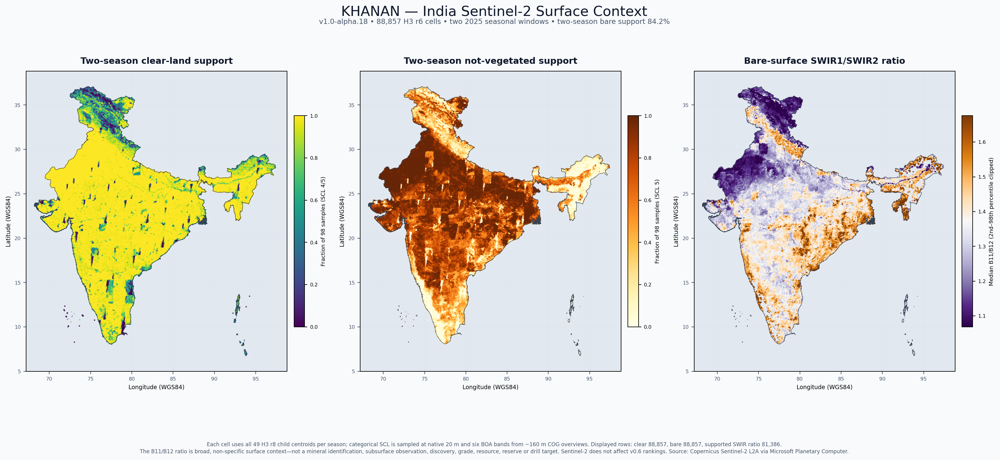

The sixth figure shows two-season clear-land coverage, not-vegetated support and the broad bare-surface B11/B12 ratio. It is a surface-quality and confounder-control view, not a mineral-deposit or discovery map. The layer does not create or rerank candidates. It is generated by `scripts/plot_sentinel2_surface_context.py`.

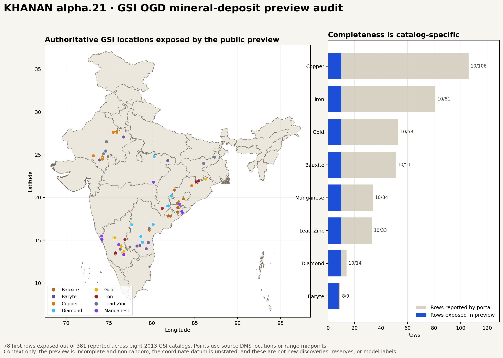

The seventh figure maps the 78 rows exposed by the eight public GSI/OGD preview endpoints and compares each preview count with its catalogue's reported total. It visualizes a partial historical catalogue sample—not an exhaustive register, reserve estimate, field confirmation or set of model-generated discoveries. It is generated by `scripts/plot_gsi_ogd_deposit_preview.py`.

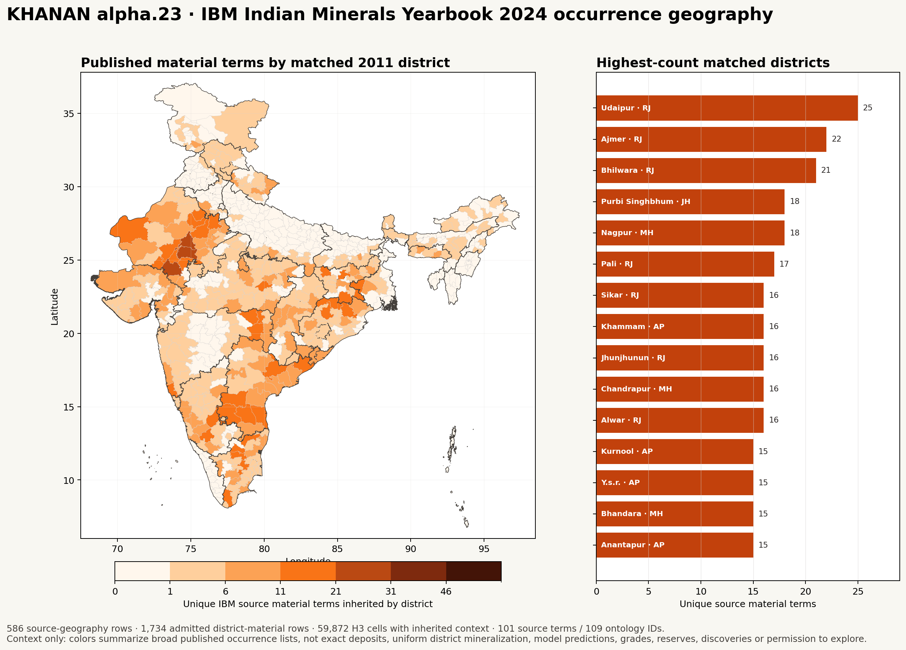

The eighth figure maps counts of published IBM source material terms inherited by unambiguously matched 2011 districts. It is a broad administrative context view, not an exact deposit map, prediction, grade, reserve or discovery claim. It is generated by `scripts/plot_ibm_imyb_state_review_occurrences.py`.

## Feature-admission evidence

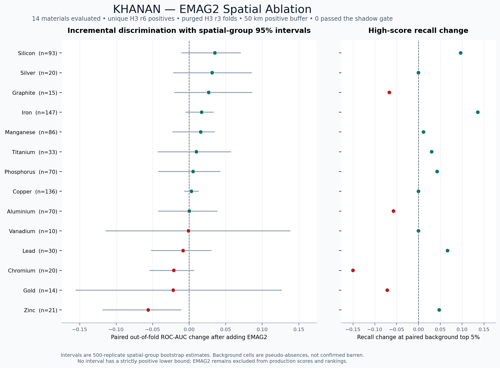

Every positive point estimate remains statistically inconclusive under the spatial-group bootstrap. Silicon shows the largest supported point improvement (`+0.0352` ROC-AUC), but its interval crosses zero. Zinc degrades by `-0.0561`, with a wholly negative interval. The exact protocol, gates and limitations are documented in [`docs/emag2_spatial_ablation.md`](docs/emag2_spatial_ablation.md).

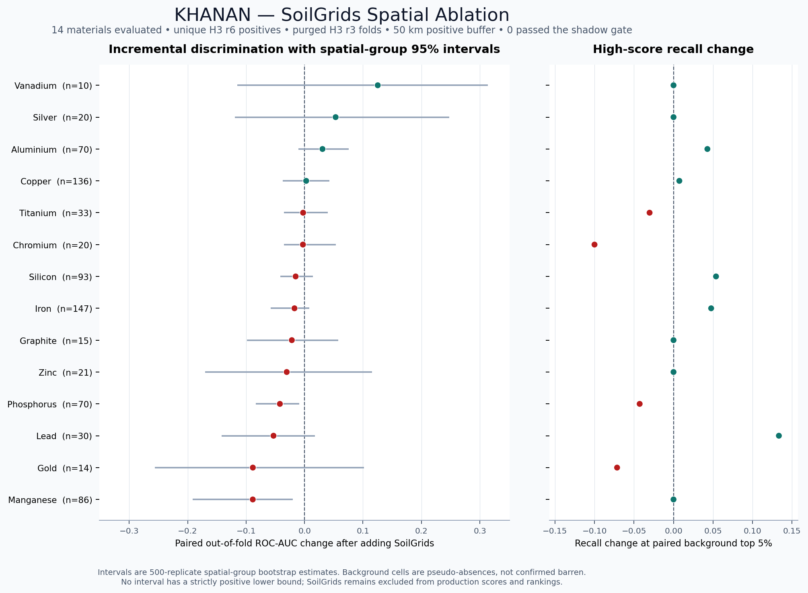

Four of 14 SoilGrids point estimates improve and ten decline. Aluminium is the strongest adequately supported positive result (`+0.0307` ROC-AUC), but its spatial-group interval crosses zero. Phosphorus and manganese have wholly negative intervals. No material passes the admission gate, and SoilGrids remains excluded from production scoring. The exact protocol is documented in [`docs/soilgrids_spatial_ablation.md`](docs/soilgrids_spatial_ablation.md).

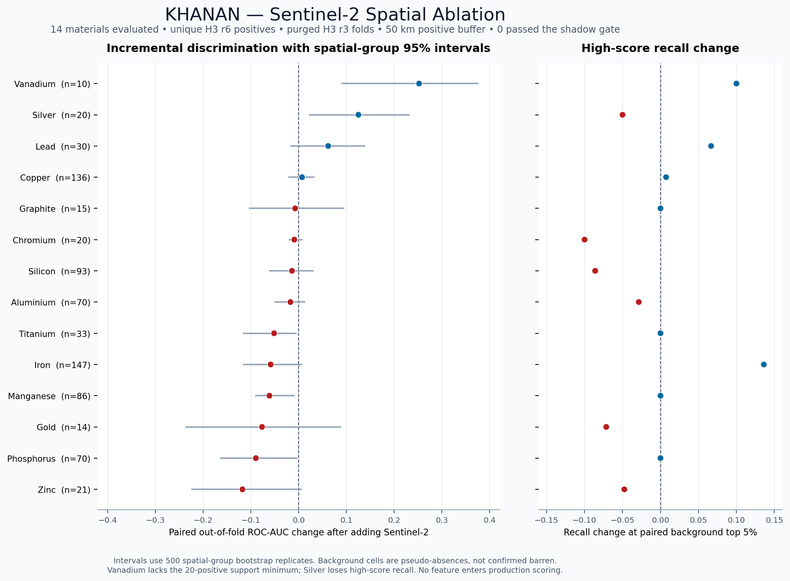

Four of 14 Sentinel-2 point estimates improve and ten decline. Vanadium is under-supported, Silver loses high-score recall, and Lead's interval crosses zero. No material passes the complete gate. The exact baseline is reproduced, imagery-quality fields are excluded from predictors, and candidate rankings remain unchanged. The protocol is documented in [`docs/sentinel2_spatial_ablation.md`](docs/sentinel2_spatial_ablation.md).

## Independent transfer evidence

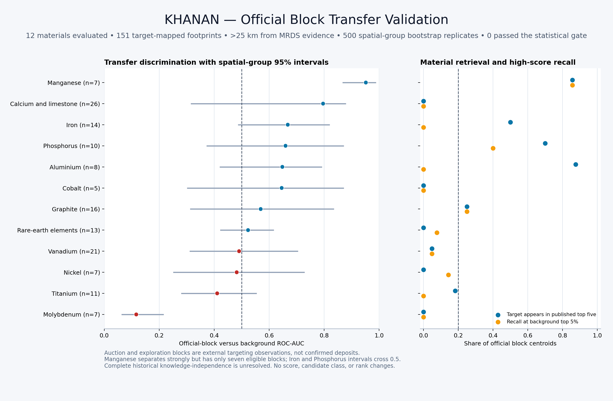

The held-out official-block evaluation screens 166 accepted source footprints; 151 map to the v0.6 targets and contribute 221 material observations. Twelve materials have enough outside-25-km block support for estimates, but none passes every fixed support, internal-validation, transfer-AUC, uncertainty, recall and material-retrieval gate. The official footprints remain context and validation observations only; they are not confirmed deposits or production labels. The protocol is documented in [`docs/official_block_transfer_validation.md`](docs/official_block_transfer_validation.md).

## Autonomy statement

Within its digital research scope, baseline v0.6 was acquired, parsed, normalized, spatially joined, modeled, validated, visualized, documented, and packaged autonomously by AI agents under a human-defined objective. The agents preserved source wording, hashes, quality flags, and exceptions rather than silently manufacturing missing values.

The intended operating model is a continuously scheduled, 24/7 group of specialized AI agents that monitor public sources, detect changes, rebuild affected layers, test regressions, and publish versioned candidate data. That continuous scheduler is **not currently running**; it will be activated only when explicitly authorized. Field verification, legal decisions, community engagement, and permission to access land remain human responsibilities.

## How KHANAN builds the map

1. **Create a stable national grid.** The India boundary is polyfilled with H3 resolution-6 cells. Each cell retains a WGS84 centroid, polygon and area.
2. **Acquire source evidence.** Agents collect open or publicly accessible mineral occurrences, mine/prospect records, IBM inventories and inspections, official auction documents, geology, elevation, population, Census and meteorological data.
3. **Preserve provenance.** Every dataset receives source identifiers, URLs, reference dates, access notes, licensing qualifications and known limitations. Official PDFs are recorded with hashes, sizes and page counts.
4. **Normalize materials.** Source wording is crosswalked to a typed 254-entity ontology containing English names, defensible chemical names, symbols or formulae, representative ores/forms, strategic uses, authority links, and parent relationships. Vague or unmapped terms remain explicit rather than being guessed. A separate 50-material legacy set defines current model eligibility.
5. **Build cell features.** Geology, elevation, slope, relief, rolling twelve-month climate, gridded population, district demographics, uncertainty-aware magnetic and soil context, and quality-controlled seasonal Sentinel-2 surface context are spatially associated with every cell.
6. **Construct neighbourhood evidence.** The pipeline measures nearby known-site density and distance while using spatially separated folds to reduce leakage from adjacent cells.
7. **Train material-specific screens.** Models are fitted only where enough mapped evidence exists. Unsupported materials remain visibly unscored rather than receiving invented predictions.
8. **Validate spatially and across sources.** Holdout groups are separated geographically. Candidate promotion requires minimum evidence, distance, percentile, score and pseudo-absence ROC-AUC gates. Separately held-out official block footprints test transfer without becoming training labels.
9. **Classify the national grid.** Cells are labelled `known_evidence_area`, `priority_candidate`, `high_priority_candidate`, or `regional_background` with model support and quality flags.
10. **Cross-check official geometries.** Auction footprints are validated for polygon integrity, published-area agreement and stated-state consistency. Source conflicts are retained and flagged.
11. **Package for data science.** The release emits canonical CSVs, validation JSON, a source registry, a data dictionary, checksums, a review workbook and a compressed portable bundle.
12. **Iterate without rewriting history.** Each material change produces a versioned release; validation failures block publication rather than being hidden.

## Feature readiness

| Signal family | Current state | Intended use and safeguards |
|---|---|---|
| Known mines, prospects and occurrences | Implemented | Positive evidence with source-specific quality controls. |
| IBM abandoned-mine inventory | Implemented as context | Named historical-status records; excluded from scoring because the source publishes no coordinates or controlling current status. |
| IBM 2024 mining-lease and auction-granted concession context | Implemented as context; IBM-row spatial review complete | National/state/mineral/sector/area-band distributions and 97 named blocks. Alpha.16 reviews every row: 92 exact State MBS selections plus five Andhra exact-name searches without a current public MBS match. Sixty-seven validated source footprints are admitted, 25 selected-MBS records are withheld, and five Andhra rows retain status evidence without inferred geometry. |
| IBM 2024 State Review occurrence geography | Implemented as district/named-area/statewide context; not model evidence | Alpha.23 publishes 586 source-geography rows, 1,742 explicit 2011-district crosswalk rows and 59,872 sparse H3 context rows. All 101 source material terms map to the central ontology. One-to-many historical district names are withheld from cell propagation; district context is never treated as a point occurrence or uniform mineralization. |
| Official auction footprints and results | Implemented and used for held-out transfer diagnostics | Excluded from model training and scoring. Alpha.20 screens 166 accepted footprints; 151 target-mapped footprints generate 221 material observations. No material passes every statistical gate, and auction targeting is not a confirmed deposit label. |
| Geological map units | Implemented | Regional age, group, supergroup and stratigraphic context. |
| Terrain | Implemented | Elevation, approximate slope, relief and terrain class. |
| Weather and climate | Implemented | Daily-derived twelve-month temperature, precipitation, humidity and wind summaries. |
| Population and demographics | Implemented | Responsible-planning context; not a geological cause of mineralization. |
| Soil texture and properties | SoilGrids 2.0 context implemented and ablated; not admitted to scoring | Nine properties at two depths include mean and 90% prediction-interval endpoints. Fourteen materials were tested across 70 purged spatial folds; none passed the uncertainty-aware admission gate. Global modeled values are not field assays. NGDR soil/geochemical values remain catalog-only. |
| Satellite mineral and alteration signatures | Sentinel-2 broad surface context implemented and ablated; not admitted to scoring | Alpha.18 publishes six-band BOA reflectance, broad indices, ratios, native-SCL masking and two-season support for all 88,857 cells. Alpha.19 tests 18 predictors across 70 purged folds: no material passes every admission gate. Hyperspectral and deposit-type validation remain planned. |
| Vegetation, crop ecology and phenology | Planned | Possible indirect soil, moisture or geochemical stress signals; must survive independent validation. |
| Agriculture and aggregate dietary patterns | Research-only/planned | Area-level context only. Never individual-level data and never treated as causal mineral evidence without a defensible scientific mechanism. |
| Hydrology and groundwater chemistry | Planned | Catchment-aware transport and geochemical anomaly context. |
| Geophysics | EMAG2v3 context implemented and ablated; not admitted to scoring | Fourteen supported materials were evaluated across 70 purged spatial folds. No material passed the uncertainty-aware admission gate, so existing scores remain unchanged. NGDR magnetic/gravity values remain catalog-only. |
| Geochemistry and drilling | EarthChem ECL 4498 context implemented; NGDR catalog audited | Alpha.17 adds 1,323 CC-BY analytical observations for 13 targeted samples at two sites with method, qualifier, hash and citation provenance. They remain excluded from scoring pending spatially independent evaluation. NGDR schemas and counts are inventoried, but NGDR feature values remain unpublished and unintegrated. |
| Historical GSI mineral-deposit catalogues | Partial public-preview context implemented; not model evidence | Alpha.21 publishes 78 of 381 reported rows across eight 2013 GSI/OGD catalogues, including source coordinate text, host rock, formation and metallogenic context where exposed. The 20.47% preview is incomplete and non-random; all rows are excluded from training, validation and scoring. |
| Infrastructure and environmental constraints | Planned | Roads, rail, power, water, forests, protected areas, archaeology, tenure and social safeguards. |

## Release files

The Alpha 3.0 portable release is [`outputs/india_mining_dataset_csv_bundle_v1.0-alpha.30.zip`](outputs/india_mining_dataset_csv_bundle_v1.0-alpha.30.zip). An earlier v0.6 copy is also stored on [Google Drive](https://drive.google.com/file/d/1IpbPo6m7BDNr1rZcyEMelUfCNJneQBIf/view?usp=drivesdk) in the [KHANAN Drive folder](https://drive.google.com/drive/folders/1K3o1FL2Wxoe-Cz8GiohFSYiV2XZ2FsIL); it is not the current Alpha 3.0 artifact. The uncompressed nationwide prospectivity grid is excluded from the Git checkout because it exceeds GitHub's ordinary file-size limit, but it is included in the portable bundle.

| File | Rows | Role |
|---|---:|---|
| `outputs/india_mining_prospectivity_grid_h3_r6.csv` | 88,857 | Complete national H3 grid with geology, terrain, climate, population, demographics, EMAG2v3 and SoilGrids context, material scores, validation and quality flags. Included inside the current portable bundle. |
| `outputs/india_mining_candidate_areas_validation_gated.csv` | 2,784 | Validation-gated priority and high-priority cells, ranked nationally, with non-scoring EMAG2v3 and SoilGrids context appended. |
| `outputs/india_mining_candidate_areas_validation_gated.geojson` | 2,784 | Exact typed Polygon GeoJSON view of the ranked candidate CSV; each feature includes a SHA-256 of its complete source row. |
| `outputs/india_emag2v3_magnetic_features_h3_r6.csv` | 88,857 | Standalone H3 magnetic feature table: anomaly, local variability, error, source code, uncertainty and provenance fields. |
| `outputs/india_soilgrids_v2_soil_features_h3_r6.csv` | 88,857 | Standalone H3 soil table with nine properties, two depths, p05/p95 uncertainty bounds, derived USDA texture classes and provenance. |
| `outputs/india_sentinel2_surface_context_h3_r6.csv` | 88,857 | Standalone H3 two-season surface-context table with six BOA-reflectance bands, broad indices and ratios, native-SCL support counts, source-scene lineage and explicit model exclusion. |
| `outputs/india_sentinel2_scene_manifest_2025.csv` | 950 | Selected 2025 Sentinel-2 scenes: 475 India-relevant MGRS tiles in each fixed window, with quality metadata, token-free asset lineage, product-metadata hashes and radiometric constants. |
| `outputs/india_earthchem_geochemical_samples.csv` | 13 | Published EarthChem sample locations, bulk trace-element values, H3/admin/geology context, analytical coverage, source hashes, license and model exclusions. |
| `outputs/india_earthchem_geochemical_observations.csv` | 1,323 | Long-form whole-rock and mineral-spot chemistry with source tokens, numeric values, methods, reference materials, qualifiers, cell coordinates and attribution. |
| `outputs/india_gsi_ogd_mineral_deposit_preview.csv` | 78 | Coordinate-bearing rows exposed by eight historical GSI/OGD mineral-deposit preview endpoints, with raw and interpreted coordinates, catalogue geology, H3/admin checks, cross-source context and mandatory model exclusion. |
| `outputs/gsi_ogd_mineral_deposit_catalog_audit.csv` | 8 | Per-catalogue identifiers, source/resource URLs, reported and preview counts, completeness, schemas, licensing, access limits and hashes. |
| `outputs/gsi_ogd_mineral_deposit_preview_validation.json` | 1 | Exact source-identity, row-count, coordinate, State-boundary, cross-source, model-exclusion and unchanged-grid/candidate-hash checks for the partial preview layer. |
| `outputs/india_ibm_state_mineral_occurrences_2024.csv` | 586 | Page-referenced IBM State Review material occurrences at district-list, named-area or statewide scope, with ontology links and source-text checks. |
| `outputs/india_ibm_district_mineral_occurrences_2024.csv` | 1,742 | Exploded source district/material mentions with explicit 2011 boundary crosswalk status, representative district points, Census context and mandatory model exclusion. |
| `outputs/india_ibm_district_mineral_context_h3_r6.csv` | 59,872 | Sparse H3-to-district-profile join with occurrence/material counts and human context; detailed materials remain normalized in the district table. Omission is not mineral absence and centroids are not occurrence coordinates. |
| `outputs/ibm_imyb_state_review_occurrences_validation.json` | 1 | Source PDF hash, term/page checks, crosswalk counts, ontology coverage, H3 uniqueness and interpretation-contract validation. |
| `outputs/india_known_mining_sites.csv` | 781 | Georeferenced mines, past producers, prospects, occurrences, plants and unknown-status MRDS records. |
| `outputs/india_ibm_mcdr_inspection_events_2023_2026.csv` | 1,504 | IBM regional MCDR inspection-table events; not proof of production or compliance. |
| `outputs/india_ibm_mcdr_latest_inspected_mines.csv` | 1,353 | Practical latest-event view of MCDR records. |
| `outputs/india_ibm_abandoned_mine_sites.csv` | 82 | IBM's named abandoned/orphaned-mine inventory for reclamation context; no coordinates or current-status inference. |
| `outputs/india_ibm_mining_lease_distribution_2024.csv` | 123 | IBM 2022–2024 state/UT and provisional 2024 mineral, sector and lease-area-band aggregates; non-spatial context only. |
| `outputs/india_ibm_auctioned_mineral_concessions_2023_24.csv` | 97 | IBM Table 5 mining leases and composite licences described as granted through auction; no coordinates, geometries or current-operation inference. |
| `outputs/india_ibm_auctioned_concession_mbs_match_audit_2023_24.csv` | 97 | Complete IBM-row audit of the alpha.16 State MBS review scope, source profiles, coordinate-evidence class, selected documents, missing-current-index matches, conflicts and geometry-admission outcomes. |
| `outputs/india_ibm_auctioned_concession_geometries_2023_24.csv` | 67 | Validated source footprints with normalized materials, drilling, resources, grade, climate, terrain, hydrology, access, geometry checks and document provenance. Context only. |
| `outputs/india_ibm_auctioned_concession_geometries_2023_24.geojson` | 67 | GeoJSON representation of the same 67 validated source footprints. |
| `outputs/india_ibm_auctioned_concession_status_evidence_2023_24.csv` | 5 | Dated official-secondary status, area, bidder, bid, drilling and event evidence for all five Andhra IBM rows; no polygons or operating-status inference. |
| `outputs/india_ibm_nmi_2025_resource_inventory.csv` | 722 | IBM NMI national, grade/measure and state/UT reserves/resources as at 1 April 2025. |
| `outputs/india_official_critical_mineral_blocks.csv` | 199 | 143 auction offers across tranches I–VIII plus 56 successful results through tranche VII. |
| `outputs/india_official_critical_mineral_mbs_manifest.csv` | 143 | MBS/NIT provenance, document hashes, extraction methods and geometry checks. |
| `outputs/india_strategic_materials_top50.csv` | 50 | Legacy v0.6 modeling-target set, chemical names, formulae, ores/forms, uses and source linkage. |
| `outputs/india_material_ontology_v1.csv` | 254 | Typed material identities, authority metadata, source evidence, formulas/names, relationships and model-eligibility fields. |
| `outputs/material_source_term_crosswalk_v1.csv` | 611 | Auditable mapping of raw terms from MRDS, IBM NMI, IBM MCDR, IBM abandoned mines, IBM concession and State Review tables, auctions and USGS MCS to ontology entities. |
| `outputs/material_ontology_validation_v1.json` | 1 | Ontology uniqueness, type counts, parser coverage, source hashes, State Review reconciliation, unchanged model hashes, mapping rate and unresolved-term report. |
| `outputs/material_model_support.csv` | 50 | Evidence counts and support tier by material. |
| `outputs/material_model_validation.csv` | 50 | Spatial holdout results and reasons a material could not be validated. |
| `outputs/ngdr_service_inventory.csv` | 11 | Metadata-only inventory of selected NGDR mineral, geochemistry, geophysics, soil, lithology and geology services; no feature values. |
| `outputs/source_registry.csv` | 38 | Provenance, access/licensing notes, uses and limitations. |
| `outputs/release_artifact_manifest.csv` | 44 | Frozen schema, primary key, evidence role, model-use status, hashes, source lineage, scope, uncertainty and exclusion controls for 43 CSVs and one GeoJSON. |
| `outputs/coverage_gap_register.csv` | 58 | All 38 source-specific limitations plus 20 cross-cutting geographic, temporal, licensing, access, method, validation and operational gaps. |
| `outputs/data_dictionary.csv` | 1,928 | Exactly one field definition, unit and missing-value policy for every column in all 43 published CSVs. |
| `outputs/validation_report.json` | 1 | Cross-dataset counts, join coverage, coordinate checks and guardrails. |
| `outputs/release_governance_validation.json` | 1 | Manifest inventory, schema freeze, primary-key, dictionary-completeness, gap-coverage, evidence-role and unchanged-model checks. |
| `outputs/official_critical_blocks_validation.json` | 1 | Auction count, lineage, provenance and geometry validation. |
| `outputs/ibm_nmi_2025_extraction_validation.json` | 1 | NMI PDF extraction and UNFC subtotal validation. |
| `outputs/ibm_mcdr_inspection_validation.json` | 1 | IBM page, fiscal-year, date and document-link validation. |
| `outputs/ibm_abandoned_mines_validation.json` | 1 | IBM source-page hash, narrative funnel, row counts, material mappings and mandatory model exclusions. |
| `outputs/ibm_mineral_concessions_2024_validation.json` | 1 | IBM yearbook hash, aggregate reconciliations, Table 5 serial/missing-area checks, ontology coverage and mandatory model exclusions. |
| `outputs/ibm_auction_mbs_geometry_validation.json` | 1 | State-portal inventory counts, reviewed-match coverage, geometry gate outcomes, source conflicts and output hashes. |
| `outputs/ibm_auction_status_evidence_2023_24_validation.json` | 1 | Andhra status-source hashes, record linkage, event, area, date-conflict and mandatory model/geometry exclusion checks. |
| `outputs/ngdr_service_validation.json` | 1 | Live OGC capability hashes, selected-layer counts, bounded-probe checks and redistribution/model exclusions. |
| `outputs/emag2v3_magnetic_features_validation.json` | 1 | EMAG2 source-file hashes, raster metadata, coverage, source-code distribution, join distances and model-exclusion checks. |
| `outputs/material_emag2_spatial_ablation.csv` | 50 | Material-level paired spatial-ablation metrics, uncertainty intervals and feature-admission decisions. |
| `outputs/material_emag2_spatial_ablation_folds.csv` | 70 | Fold-level sample counts, separation checks and paired baseline/EMAG metrics. |
| `outputs/emag2_spatial_ablation_validation.json` | 1 | Ablation protocol, fixed gates, input/output hashes, aggregate results and proof that rankings were unchanged. |
| `outputs/soilgrids_v2_soil_features_validation.json` | 1 | WCS request URLs, 54 raster hashes and metadata, coverage, ranges, uncertainty checks, join distance and ranking invariants. |
| `outputs/material_soilgrids_spatial_ablation.csv` | 50 | Material-level paired SoilGrids ablation metrics, uncertainty intervals and feature-admission decisions. |
| `outputs/material_soilgrids_spatial_ablation_folds.csv` | 70 | Fold-level sample counts, separation checks and paired baseline/SoilGrids metrics. |
| `outputs/soilgrids_spatial_ablation_validation.json` | 1 | SoilGrids ablation protocol, fixed gates, input/output hashes, aggregate results and proof that rankings were unchanged. |
| `outputs/material_sentinel2_spatial_ablation.csv` | 50 | Material-level paired Sentinel-2 ablation metrics, spatial-group uncertainty intervals and fixed feature-admission decisions. |
| `outputs/material_sentinel2_spatial_ablation_folds.csv` | 70 | Fold-level sample counts, separation checks, surface-feature coverage and paired baseline/Sentinel-2 metrics. |
| `outputs/sentinel2_spatial_ablation_validation.json` | 1 | Sentinel-2 ablation protocol, baseline parity, fixed gates, input/output hashes and proof that national-grid and candidate files were unchanged. |
| `outputs/material_official_block_transfer_validation.csv` | 50 | Material-level held-out official-block transfer metrics, spatial-group uncertainty, retrieval rates and fixed diagnostic gates. |
| `outputs/official_block_transfer_observations.csv` | 221 | One auditable row per unique official footprint and normalized target material, with source lineage, centroid score, distance, percentile and limitations. |
| `outputs/official_block_transfer_validation.json` | 1 | Exact v0.6 score-parity checks, official-footprint deduplication, background exclusions, fixed gates, hashes and proof that rankings were unchanged. |
| `outputs/earthchem_geochemical_validation.json` | 1 | EarthChem source checksums, dimensions, qualifier counts, coordinate/H3/admin checks, method-conflict flags and mandatory model exclusions. |
| `outputs/sentinel2_surface_context_validation.json` | 1 | Sentinel catalog scope, scene selection, native-SCL and radiometric checks, national coverage, index ranges, token screening and unchanged-ranking hashes. |
| `outputs/nasa_power_rolling_12m_validation.json` | 1 | Weather-source checksums, completeness and range checks. |
| `outputs/india_mining_dataset_companion.xlsx` | — | Legacy v0.6 thirteen-sheet review workbook. It does not yet include the v1 ontology; the CSVs remain authoritative. |
| `outputs/alpha3_completion_audit.json` | 1 | Machine-readable pass/fail audit of the 12 consolidated Alpha 3.0 requirements and their evidence. |
| `outputs/india_mining_dataset_csv_bundle_v1.0-alpha.30.zip` | — | Deterministic Alpha 3.0 bundle, including the full grid, candidate CSV/GeoJSON, observed evidence, contextual features, validations, governance, final audit, maps and complete declared reproduction entry points. |
| `outputs/independent_release_verification.json` | 1 | Independent final ZIP, manifest, schema, key, checksum, provenance, validation, GeoJSON-parity and model-guardrail verification report. |
| `outputs/SHA256SUMS.txt` | — | Integrity hashes for published artifacts. |

## Repository structure

```text
KHANAN/
├── assets/
│   ├── README.md
│   ├── figures/                      # feature-admission and model diagnostics
│   └── maps/                         # README and release maps
├── config/                           # material, weather and curated event configuration
├── data/
│   └── README.md                     # data-layout and distribution policy
├── docs/
│   ├── emag2_spatial_ablation.md     # paired spatial feature-admission experiment
│   ├── earthchem_lithium_geochemistry.md # independent analytical geochemistry layer
│   ├── alpha3_final_release_audit.md # completion requirements, limitations and evidence
│   ├── gsi_ogd_mineral_deposit_preview.md # partial historical GSI deposit-catalog preview
│   ├── ibm_imyb_state_review_occurrences_2024.md # IBM State Review occurrence geography and crosswalk
│   ├── material_ontology_v1.md       # controlled material identities and source-term mappings
│   ├── ibm_auction_mbs_geometry_2023_24.md # State MBS document matching and spatial gates
│   ├── ibm_auction_status_evidence_2023_24.md # dated Andhra status reconciliation and limits
│   ├── methodology.md                # scientific method, validation and limitations
│   ├── ngdr_access_and_integration.md # GSI service audit, policy decision and admission gates
│   ├── official_block_transfer_validation.md # held-out source-transfer test and guardrails
│   ├── soilgrids_features.md          # soil extraction, units, uncertainty and safeguards
│   └── soilgrids_spatial_ablation.md  # paired soil feature-admission experiment
├── outputs/                          # versioned derived data and release artifacts
├── scripts/                          # acquisition, extraction, modeling, validation and plotting
├── sources/
│   └── raw/                          # reproducible local source cache; not committed to Git
├── .gitignore
├── requirements-geospatial.txt
└── README.md
```

## Detailed roadmap

### Phase 0 — Auditable baseline (completed in v0.6)

- Establish the national H3 grid and record schema.
- Integrate MRDS, IBM NMI, MCDR, Ministry of Mines/MSTC, Census, WorldPop, NASA POWER, WorldClim and regional geology.
- Build the 50-material modeling-target set and spatial validation gates.
- Publish source manifests, dictionaries, checksums and interpretation guardrails.
- Recover and validate all 143 central critical-mineral auction-offer footprints for tranches I–VIII.

### Phase 1 — Repository and release discipline (complete for Alpha 3.0)

- Maintain KHANAN as a structured, versioned repository.
- Publish reproducible overview maps and machine-readable release bundles.
- Publish the 254-entity, source-derived ontology and raw-term mapping audit without expanding model eligibility by fiat.
- Audit the public NGDR/GSI OGC catalog and publish a metadata-only readiness inventory without republishing feature values.
- Add automated schema, provenance, checksum and regression tests.
- **Completed in alpha.24:** freeze and validate every published CSV/GeoJSON schema and primary key, complete the 1,928-field data dictionary, separate five evidence roles and publish a 58-row consolidated coverage-gap register.
- **Completed in alpha.25:** independently verify the release bundle and include every declared build entry point and dependency required by the portable reproduction instructions.
- **Completed in Alpha 3.0:** publish an exact typed candidate GeoJSON, run the machine-readable completion audit, independently verify the deterministic release and publish the declared scope to the public repository.
- Future extension: introduce rolling changelogs and source-freshness reports.
- Future extension: expand source-specific redistribution and citation policy as new sources are admitted.

### Phase 2 — Authoritative mine, lease and grant layer

- Add current IBM and State Directorate of Mines and Geology registers where lawfully accessible.
- Preserve IBM's 82-site abandoned-mine inventory as non-georeferenced, historical-status context until controlling current records can be joined.
- **Completed for the current portal snapshot in alpha.16:** review all 97 IBM 2023-24 auction rows, link 92 to exact historical State Mine Block Summaries, admit 67 validated source footprints, quarantine 25 selected-MBS records with explicit failures, and publish dated status evidence for all five Andhra rows without inferring missing polygons.
- **Completed in alpha.21:** audit eight 2013 GSI/OGD mineral-deposit catalogues and publish all 78 rows exposed by their public preview endpoints, while making the 78-of-381 scope, interactive-download boundary, coordinate assumptions, source anomalies and model exclusion machine-readable.
- **Completed in alpha.22:** extract the IBM 2024 State Review occurrence geography into page-cited state, district and sparse H3 context tables; audit all administrative crosswalks; and withhold one-to-many historical districts from cell propagation.
- **Completed in alpha.23:** reconcile all 101 IBM State Review material terms with the central ontology, add 21 explicitly typed source-observed entities, correct the diaspore/dunite/marble classifications, and verify unchanged model artifacts.
- Resolve mine/block identity across spelling, mine codes, lease numbers and changing district boundaries.
- Track tender, preferred-bidder, grant, clearance, operation, suspension and closure as separate dated events.
- Add lease and legal-boundary polygons without inferring unpublished coordinates.

**Exit gate:** every claimed operating/legal status must have a dated controlling source and confidence level.

### Phase 3 — Soil, surface and ecological intelligence

- **Completed in alpha.6:** acquire CC BY 4.0 SoilGrids 2.0 pH, texture, organic carbon, CEC, nitrogen, bulk-density and coarse-fragment predictions at surface and subsoil depth, preserve 90% prediction intervals, and publish them as non-scoring context.
- **Completed in alpha.7:** run material-wise paired SoilGrids ablation across the same purged H3 spatial folds as EMAG2, quantify uncertainty with a group bootstrap, and reject production admission because no material clears every gate.
- Add India-specific measured soil and regolith observations that can independently test the global SoilGrids context.
- Add land cover, vegetation indices, crop calendars, phenology, moisture stress and thermal anomalies.
- Add drainage, watersheds, erosion, groundwater and surface-water context.
- Test whether vegetation or crop signals add out-of-region predictive value after geology and climate are controlled.

**Exit gate:** indirect ecological signals are admitted only if they improve spatial holdout performance and have a plausible mechanism.

### Phase 4 — Geochemistry, geophysics and remote sensing

- **Completed in alpha.3:** audit the NGDR guest OGC catalog, selected layer schemas, reported feature counts, coordinate metadata and GSI dissemination policy.
- **Completed in alpha.4:** acquire and hash the NOAA/NCEI EMAG2v3 anomaly, error and source-code rasters; transform them into uncertainty-aware H3 features; append them to the national/candidate tables; and publish an independent validation report and map without changing model scores.
- **Completed in alpha.5:** run material-wise paired EMAG2 ablation across purged H3 spatial folds, quantify uncertainty with a group bootstrap, and reject production admission because no material clears every gate.
- **Completed in alpha.17:** integrate EarthChem ECL 4498 under CC-BY-4.0 as 13 coordinate-bearing samples and 1,323 method-rich long-form observations; preserve every missing-value class and source anomaly; keep all rows outside model training and validation.
- **Completed in alpha.18:** select and audit 950 Copernicus Sentinel-2 Level-2A scenes across two fixed 2025 windows; sample 8,707,986 H3 child-centroid observations; apply per-product radiometry and native 20 m scene classification; publish nationwide non-scoring surface-context features, lineage, validation and a reproducible map.
- **Completed in alpha.19:** test a compact 18-feature Sentinel-2 family on the same 70 purged spatial folds and exact baseline as the prior feature experiments; exclude imagery-quality variables from predictors; quantify paired uncertainty; reject production admission because no material passes all fixed gates.
- Repeat magnetic admission testing only after materially stronger independent labels or higher-resolution geophysics become available.
- Acquire lawful NGDR/GSI/state geochemical, magnetic, gravity, radiometric and structural datasets.
- Add multispectral and hyperspectral mineral/alteration indices with sensor provenance.
- Normalize samples by analytical method, detection limit, medium, depth and survey scale.
- Construct deposit-type features for battery, fertilizer, alloy, electronics and energy raw materials.

**Exit gate:** no dataset enters production scoring without coordinate, method, scale, missingness and leakage audits.

### Phase 5 — 24/7 autonomous agent system

- **Source Scout:** monitor official portals, publications and open-data catalogues.
- **Acquisition Agent:** download versioned source snapshots and compute hashes.
- **Document Agent:** extract tables, coordinates and provenance from PDFs and web pages.
- **Geo Agent:** harmonize CRS, administrative boundaries, geometry and neighbourhood features.
- **Ontology Agent:** map minerals, elements, compounds, ores and industrial uses.
- **Model Agent:** retrain only affected material models and preserve prior artifacts.
- **Critic Agent:** challenge leakage, source conflicts, implausible values and unsupported claims.
- **Release Agent:** publish only when tests pass; otherwise quarantine the proposed update.

**Exit gate:** deterministic rebuilds, idempotent source handling, rollback, audit logs, cost controls and human approval for external publication.

### Phase 6 — Stronger prospectivity science

- Replace generic material screens with deposit-type and geological-process models.
- **Completed in alpha.20:** screen 166 accepted official auction/MBS footprints and run a source-held-out transfer diagnostic on the 151 target-mapped footprints and 221 material observations; reproduce every published top-five v0.6 value exactly; quantify H3 r3 group uncertainty; reject all production admissions.
- Add genuinely knowledge-independent confirmed positive test deposits and time-split validation.
- Quantify epistemic, source and spatial uncertainty.
- Calibrate rankings and compare against transparent geological heuristics.
- Add feature ablation, bias/fairness checks and adversarial leakage tests.

**Exit gate:** candidates must outperform simple baselines outside the regions used for training.

### Phase 7 — Responsible opportunity assessment

- Add protected areas, forests, water stress, cultural/archaeological sites, tenure and community context.
- Add roads, rail, ports, power and processing infrastructure without turning proximity into permission.
- Build exclusion and caution layers before any field-prioritization product.
- Establish an expert-review and community-engagement protocol.

**Exit gate:** no operational recommendation without legal, environmental, archaeological, social and field review.

### Phase 8 — Data-science and decision interfaces

- Publish GeoParquet/PostGIS-ready releases and STAC-compatible raster metadata.
- Add APIs, reproducible notebooks, benchmark tasks and model cards.
- Provide uncertainty-aware map exploration and region/material comparison.
- Support user-supplied data without contaminating the public evidence layer.

### Alpha 3.0 — Project completion boundary

Alpha 3.0 is the user-defined finish line for the current KHANAN goal. The `v1.0-alpha.30` release is the chronological release identifier for that milestone. Its declared scope and reproducibility gates are complete. This does not mean that India has been exhaustively explored, that every deposit is known, or that any model hypothesis is a mineral discovery.

The Alpha 3.0 release gate requires:

- a frozen, versioned schema and source registry for every published table;
- deterministic rebuilds and verified checksums for the public bundle;
- explicit separation of observed evidence, contextual features and model-generated hypotheses;
- a final coverage report identifying every known geographic, temporal, licensing and source-access gap;
- a public map and data-science-ready CSV/geospatial release with uncertainty and exclusion fields intact;
- zero unsupported claims of reserves, grades, discoveries, operating status or legal rights.

All six release gates are met. The consolidated machine-readable audit passes 12 of 12 requirements; the detailed evidence and remaining scientific limitations are in [`docs/alpha3_final_release_audit.md`](docs/alpha3_final_release_audit.md) and [`outputs/alpha3_completion_audit.json`](outputs/alpha3_completion_audit.json).

## Reproduce the current baseline

From the repository root:

```bash
python3 -m venv .venv
.venv/bin/pip install -r requirements-geospatial.txt
.venv/bin/python scripts/download_sources.py
.venv/bin/python scripts/build_dataset.py
.venv/bin/python scripts/build_official_mbs_inventory.py
.venv/bin/python scripts/build_official_blocks.py
.venv/bin/python scripts/build_ibm_nmi2025.py
.venv/bin/python scripts/build_ibm_mcdr_inspections.py --refresh
.venv/bin/python scripts/build_ibm_abandoned_mines.py --refresh
.venv/bin/python scripts/build_ibm_mineral_concessions_2024.py
.venv/bin/python scripts/build_ibm_auction_mbs_geometry_2023_24.py
.venv/bin/python scripts/build_material_ontology.py
.venv/bin/python scripts/audit_ngdr_services.py
.venv/bin/python scripts/build_emag2_features.py
.venv/bin/python scripts/evaluate_emag2_spatial_ablation.py
.venv/bin/python scripts/build_soilgrids_features.py
.venv/bin/python scripts/evaluate_soilgrids_spatial_ablation.py
.venv/bin/python scripts/build_earthchem_geochemistry.py --refresh
.venv/bin/python scripts/build_gsi_ogd_deposit_preview.py
.venv/bin/python scripts/build_ibm_imyb_state_review_occurrences.py
.venv/bin/python scripts/build_sentinel2_surface_context.py
.venv/bin/python scripts/evaluate_sentinel2_spatial_ablation.py
.venv/bin/python scripts/evaluate_official_block_transfer.py
.venv/bin/python scripts/plot_khanan_overview.py
.venv/bin/python scripts/plot_emag2_context.py
.venv/bin/python scripts/plot_emag2_ablation.py
.venv/bin/python scripts/plot_soilgrids_context.py
.venv/bin/python scripts/plot_soilgrids_ablation.py
.venv/bin/python scripts/plot_ibm_auction_mbs_geometries.py
.venv/bin/python scripts/plot_earthchem_geochemistry.py
.venv/bin/python scripts/plot_gsi_ogd_deposit_preview.py
.venv/bin/python scripts/plot_ibm_imyb_state_review_occurrences.py
.venv/bin/python scripts/plot_sentinel2_surface_context.py
.venv/bin/python scripts/plot_sentinel2_ablation.py
.venv/bin/python scripts/plot_official_block_transfer.py
.venv/bin/python scripts/build_candidate_geojson.py
.venv/bin/python scripts/build_release_governance.py
.venv/bin/python scripts/build_alpha3_completion_audit.py
node --expose-gc scripts/validate_material_ontology_csv_artifacts.mjs
node --expose-gc scripts/validate_release_governance_csv_artifacts.mjs
.venv/bin/python scripts/build_release.py
shasum -a 256 -c outputs/SHA256SUMS.txt
.venv/bin/python scripts/verify_release_independent.py --bundle outputs/india_mining_dataset_csv_bundle_v1.0-alpha.30.zip --checksums outputs/SHA256SUMS.txt --workspace . --output outputs/independent_release_verification.json
```

The XLSX companion is generated by `scripts/build_workbook.mjs` using the Codex desktop bundled spreadsheet runtime. See `docs/methodology.md` for model construction, validation thresholds and detailed limitations.

## Scientific, legal and ethical guardrails

- A predicted cell is a hypothesis for regional investigation, not evidence of a mineable deposit.
- Resources and reserves require qualified exploration, sampling, estimation and legally recognized reporting.
- Absence of a candidate label does not mean barren ground.
- Population, demographic, dietary, agricultural and ecological data must not become proxies for targeting communities or bypassing consent.
- Do not trespass, sample, drill, excavate, acquire rights, or approach protected/archaeological land based on this dataset.
- Government, environmental, forest, land, heritage and community processes remain mandatory.
- Boundary displays follow their cited source and imply no position on legal or territorial status.
- Third-party source terms vary. KHANAN does not assert a blanket license over source material; consult `outputs/source_registry.csv` before redistribution or commercial use.

## Important current limitations

The release is not an exhaustive current mine/lease register. It still lacks deposit-level NMI coordinates, comprehensive state mine registers, controlling grant status, model-admitted soil/geochemistry/geophysics/remote-sensing features, drill logs, site-level grade/tonnage/depth, mineral-specific alteration mapping, protected-area and forest-clearance layers, water stress, infrastructure, land tenure and social-license constraints. Alpha.23's reconciled IBM State Review layer is an official compilation of broad district, named-area and statewide occurrence statements; it does not locate deposits within districts, and its 59,872 H3 rows merely inherit district context. The 254-entity ontology is a vocabulary and evidence-normalization catalogue, not proof that every entity has a recoverable Indian deposit. Alpha.21's GSI/OGD table contains only the 78 rows exposed by public previews out of 381 catalogue-reported records; that 20.47% subset is non-random, the source datum is unstated, and it must not be read as complete deposit coverage. EarthChem ECL 4498 supplies measured analytical context, but only for 13 targeted samples at two sites; it is not a systematic survey and remains outside scoring. Sentinel-2 alpha.18 supplies national surface reflectance and exposure context; the alpha.19 ablation admits none of its broad predictors to production scoring. Vanadium and Silver show follow-up signals but fail the support and recall gates respectively, so neither result is a discovery or candidate claim. The 2025 imagery may also encode post-discovery mine disturbance at known positive sites; that leakage risk independently blocks production admission. Alpha.20 adds a source-held-out official-block transfer test, but no material passes every statistical gate and the block labels are not proven independent of all historical geological knowledge. Manganese's strong seven-block result is follow-up evidence, not a discovery or production validation. SoilGrids supplies national modeled pedological context but not field geochemical assays; the alpha.7 spatial ablation admits it to no production material model. EMAG2v3 supplies moderate-resolution magnetic context, but the alpha.5 spatial ablation also admits it to no production material model. NGDR service metadata is audited, but its raw values remain outside the release and scoring pipeline for the reasons documented in [`docs/ngdr_access_and_integration.md`](docs/ngdr_access_and_integration.md). Alpha.24 consolidates these and other known limitations in [`outputs/coverage_gap_register.csv`](outputs/coverage_gap_register.csv); disclosure does not imply every unknown gap has been discovered or resolved.

One official Biarpalli source table places an Odisha block near 89°E; KHANAN retains and flags the published coordinates. The 143 auction-offer observations reconstruct to 100 distinct published footprints, while the tranche-VIII government release reports 88 cumulative offered blocks. That discrepancy remains explicitly unreconciled.

For the complete provenance and interpretation contract, read [`docs/methodology.md`](docs/methodology.md), [`docs/release_governance_alpha24.md`](docs/release_governance_alpha24.md), [`docs/independent_release_verification_alpha25.md`](docs/independent_release_verification_alpha25.md), [`docs/alpha3_final_release_audit.md`](docs/alpha3_final_release_audit.md), [`outputs/source_registry.csv`](outputs/source_registry.csv), [`outputs/release_artifact_manifest.csv`](outputs/release_artifact_manifest.csv), [`outputs/coverage_gap_register.csv`](outputs/coverage_gap_register.csv), [`outputs/data_dictionary.csv`](outputs/data_dictionary.csv), [`outputs/india_mining_candidate_areas_validation_gated.geojson`](outputs/india_mining_candidate_areas_validation_gated.geojson), [`outputs/alpha3_completion_audit.json`](outputs/alpha3_completion_audit.json), and [`outputs/independent_release_verification.json`](outputs/independent_release_verification.json).
